# Light-Science-Students-Analysis

## Introduction

This is an Excel analysis of an imaginary school called "Light science teaching hospital" The project is to do a pivot table and visualize to derive insights to critical questions asked.I came across the dataset online and applaud how rich the data is as I have been trying to get more knowledge
with a very rich dataset to practice my skills of data cleaning, analysis and visualization.
*_Disclaimer_*: All datasets and reports do not represent any company, institution, or country, but just a random dataset to demonstrate the power of excel.

## Problem statement

Using the Medical Students Data, create Pivot Tables displaying the following:
1. Average values for the following for Male and Females (Age, BMI, Temperature, Heart Rate, Blood Pressure, and Cholesterol)
2. Average Height and Weight for both Genders (in 2 decimal places)
3. Number of students across the different Blood Groups.
4. Number of Students who smoke and those who don't.
5. Number of Students who have diabetes and those who don't.

## Skills/ concept demonstrated

The following excel features were incorporated:
Excel function applied:
- Average
- find & select
- fill
- Pivot table
- Pivot chart: Column chart, Pie chart, Bar chart.

## Data sourcing

Until the above questions were mentioned did i went ahead to get the data, i then downloaded the csv file and extracted it into excel for cleaning, analysis and visualization.

## Data cleaning

Data was efficiently cleaned and blanks filled with excel Using the Light science teaching hospital Medical Students Data, 
create Pivot Tables displaying the "LIGHT SCIENCE TEACHING HOSPITAL Medical students" with 200,000 rows and 13 columns
The medical dataset was not clean, there were lots of blank cells in every column
The first Column titled as student column was first deleted, then I needed to fill it to 200,000
In Cell A2, I typed 1 then afterwards went to the home tab to 'fill up', which was done by clicking 'fill',
click "series", click "column", choose "linear", "start value is 1 and stop value is 200,000".
To clean other columns, Each column was highlighted, from the home tab I clicked ‘find & select’ 
and then ‘select blanks’ and then okay all empty cells are highlighted. 
I input the value/text  (Average of Height, Weight, BMI & Temperature) then hold control and enter to fill it up.

## Visualization

The report comprises of 11 screenshots, 6 Screenshots of Pivot table and 5 screenshots of pivot chart.

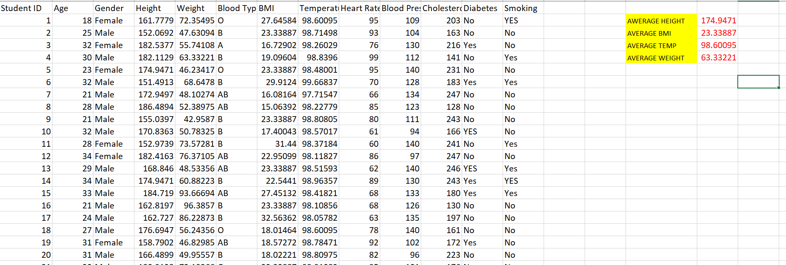

- DATASET

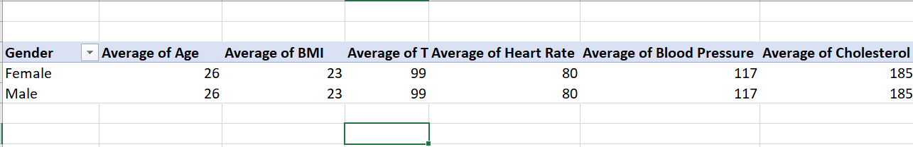

- Average values for the following for Male and Females (Age, BMI, Temperature, Heart Rate, Blood Pressure, and Cholesterol)
  
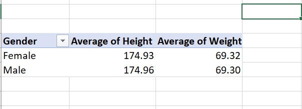

- Average Height and Weight for both Genders (in 2 decimal places)

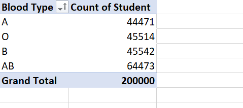

- Number of students across the different Blood Groups.
   
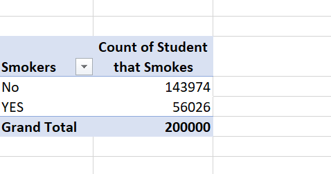

- Number of Students who smoke and those who don't.

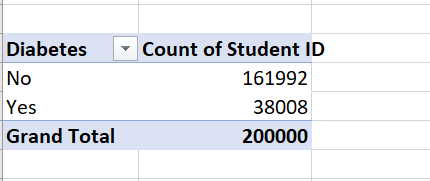

- Number of Students who has diabetes and those who don't.

### Pivot chart

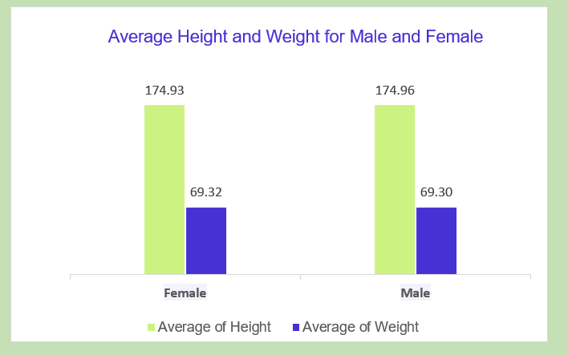

- Average Height and Weight for both Genders

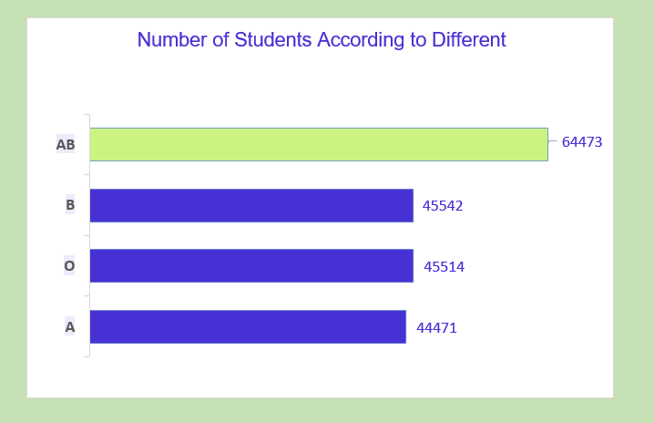

- Number of students across the different Blood Groups.

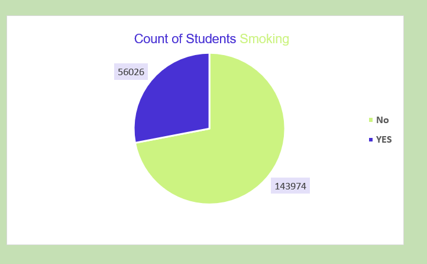

- Number of Students who smoke and those who don't.
  
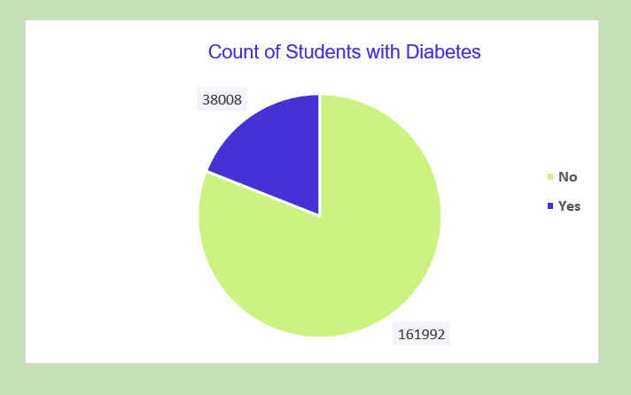

- Number of Students who has diabetes and those who don't.

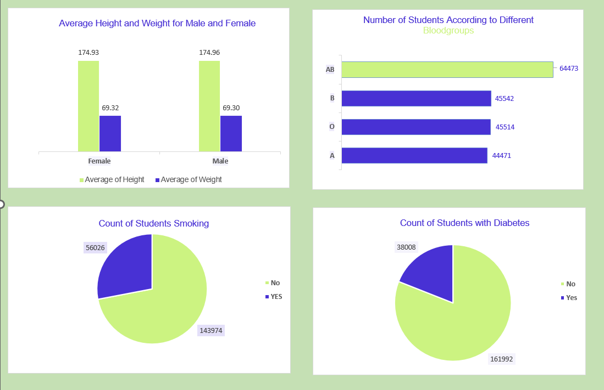

- Data visuals

## Conclusion

- Average height of the males was almost the same with the females.
- Average weight of the females were slightly higher than the males. 
- AB blood groups were the highest among A,B,O,AB Bloodgroups.
- The number of students who don't smoke are more than students who smoke.	
- The number of students with diabetes were more than students who dont have.	
  
### *_THE END_*

